# spring的实现及其疑惑解答
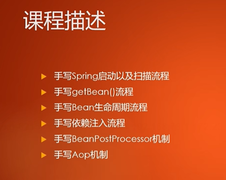
# 1 spring的两种容器

## 1.1 使用方式（spring如何获取需要注册bean的类）!!!

```java
   public static void main(String[] args) {
        #A
        ClassPathXmlApplicationContext classPathXmlApplicationContext = new ClassPathXmlApplicationContext("spring.xml");
        User user = (User)classPathXmlApplicationContext.getBean("user");
        
        #B
        AnnotationConfigApplicationContext applicationContext = new AnnotationConfigApplicationContext(AppConfig.class);
        UserService userService = applicationContext.getBean("userService", UserService.class);
    }
```


### 1.1.1 ClassPathXmlApplicationContext
可以参考代码中的#A，可知道这里的容器创建借助的是spring.xml这个配置文件

### 1.1.2 AnnotationConfigApplicationContext
这种方式是基于注解的实现，AppConfig.class，而AppConfig
中得内容如下图所示：可以看到我们定义了spring得扫描的路径，spring
会自动扫描"com.zhouyu"包下的所有java文件并且生成相应的bean，也可以
通过@Bean注解手动定义某一个bean。


## 1.2 spring获取bean的相关细节
大概流程：
解析配置类：new一个ApplicationContext并且传递配置类->解析配置类获取componentScan注解中规定的路径->扫描路径下的java类->注册为容器中的bean

详细说明：
当new一个ApplicationContext对象的时候就相当于创建了一个容器，会
调用这个容器的构造方法，我们需要将指定的配置类传递给它，因为配置类中通过
@componentScan注解规定了扫描的包的全限定名，然后将这个限定名转换成
路径，随后扫描这个路径下的所有java类，并将其注册到IOC容器中称为bean。

```java
package com.zhouyu;

import com.spring.ComponentScan;

@ComponentScan("com.zhouyu.service")
public class AppConfig {
    
}

```
## 1.3 加入IOC容器中，为什么需要两个map？
在扫描一个类时，会首先查看类上是否有@Component字段，如果有则说明
需要加入IOC的容器中，否则不需要，如果需要加入容器，则需要创建两个map。

### 1.3.1 接下来弄清楚这两个map是什么，

首先是定义Map，我们叫BeanDefinitionMap，这个map中的value是BeanDefinition类，
存储的是一个类的元数据，包括但不限于这个类的Class对象，单例还是多例等，
key是其类中@Component注解的指定值，这个map是spring创建bean时的重要参考，
因为它能以O(1)的复杂度取获取创建bean的元数据。

第二个才是真正的对象map，也称作单例池，只存储@Component为"singleton"的
实例对象,如果@Component的值为prototype则不会存储到这个池子中，
其key是@Component注解的指定值，其value为spring启动时就创建的对象。


### 1.3.2 为什么需要这两个map？

这两个`map`在Spring框架中扮演重要角色，它们分别用于存储bean的元数据(`BeanDefinition`)和单例bean的实例。我们分开解释它们的作用：

1. **BeanDefinitionMap**:

   这个`map`存储了bean的元数据，包括bean的类型(`Class`对象)以及其他配置信息（如bean是单例还是多例）。当Spring需要创建一个bean的实例时，它首先查找这个`map`来获取bean的元数据(`BeanDefinition`)。这个元数据包含了Spring需要知道的所有信息来正确地创建bean。

   为什么这个重要？因为这使得Spring可以以一种非常高效的方式管理和创建bean。存储这些元数据允许Spring重用这些信息，而不必每次都重新解析类或注解。

2. **单例池(Singleton Pool)**:

   这个`map`专门用于存储单例bean的实例。当一个bean被定义为单例时，这意味着在整个应用程序的生命周期中，这个bean只会有一个实例。Spring在启动时或在首次请求时创建这个实例，并将其存储在这个`map`中。当你再次请求这个bean时，Spring只需从这个`map`中检索实例，而不是重新创建它。

   这对于资源密集型的对象非常有用，比如数据库连接池，因为你不希望每次请求时都创建一个新的实例。

综上所述，这两个`map`分别用于：

- 让Spring能够快速查找到如何创建bean的信息（通过`BeanDefinitionMap`）。
- 为单例bean提供一个高效的存储机制，这样Spring只需要创建一个实例，然后在后续的请求中重复使用这个实例。

这种设计支持了Spring的核心特性，包括依赖注入、bean的生命周期管理以及性能优化。

这也是当component中规定一个类为多例时不不用放入map的原因，
主要是因为单例池就是为了避免创建重复的实例。

## 1.4 创建单例bean和多例bean的过程
首先会传入一个字符串调用ApplicationContext的getBean方法，
该方法首先会通过bean的定义map查询对应类的元数据，
元数据包含了该类是支持单例还是多例，如果是单例会
访问单例池取得早就创建的单例对象并返回，如果是多例
会创建一个新的实例并返回。


## 1.5 为什么可以通过字符串就可以从容器中取到对应的bean？
> 这里的容器实际上是一个map对象，这里的字符串在类上的@Component
> 的注解中声明和bean对象唯一绑定在一起(UserService类)，在扫描
> 的时候会解析@Component注解，然后将其放入到beanDefinitionMap中

```java
public class Test {

    public static void main(String[] args) {
        ZhouyuApplicationContext applicationContext = new ZhouyuApplicationContext(AppConfig.class);

        Object userService = applicationContext.getBean("userService");

    }
}
```
```java
@Component("userService")
@Scope("prototype")
public class UserService {

}
```

## 1.6 如何创建单例和多例bean？
扫描阶段会判断这个类中是否有@Scope注解，如果有就会查看其值是否是
"prototype", 如果是则


# 2 spring的依赖注入的实现方式

## 2.1 什么是依赖注入？
### 2.1.1 spring中什么是依赖？
一个类中的某一个属性是一个对象，那么可以称该类依赖这个对象。


如下所示Car类以来了Engine类的实例。
```java
@Component
public class Car {
    private Engine engine;
    
}

public class Engine {
    // ... Engine 类的实现
}
```
### 2.1.2 什么是注入？
在Spring中，注入（Injection）是指将一个对象自动地赋值给另一个对象的属性、setter方法或构造方法。这是通过Spring的IoC（控制反转）容器完成的，它负责创建对象，绑定它们的依赖关系，并提供完成初始化的对象。

注入主要有三种形式：

1. **构造器注入**：这是通过使用类的构造方法来注入依赖。Spring IoC容器会自动创建依赖的实例，并通过构造函数传递给需要它们的对象。

    ```java
    @Component
    public class Car {
        private final Engine engine;
    
        @Autowired
        public Car(Engine engine) {
            this.engine = engine;
        }
    }
    ```

2. **Setter注入**：这是通过使用setter方法来注入依赖。Spring IoC容器创建依赖的实例，并使用setter方法将其传递给需要它的对象。

    ```java
    @Component
    public class Car {
        private Engine engine;
    
        @Autowired
        public void setEngine(Engine engine) {
            this.engine = engine;
        }
    }
    ```

3. **字段注入**：这是通过直接将依赖注入到类的字段上。这种方式通常不推荐，因为它可以导致代码难以测试和维护。

    ```java
    @Component
    public class Car {
        @Autowired
        private Engine engine;
    }
    ```

在Spring中，注入的主要目的是实现解耦。通过自动管理对象的创建和它们的依赖关系，可以使代码更加模块化，更易于测试和维护。此外，通过使用配置，你可以轻松地更改注入的实际实现，而无需修改代码。

### 2.1.3 那依赖注入呢？
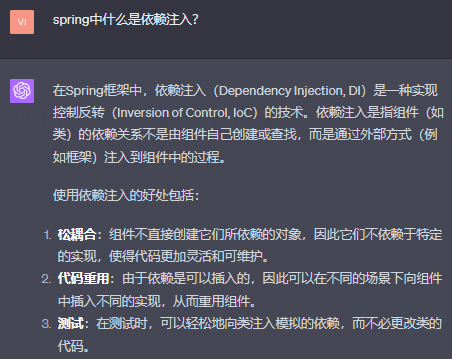

### 2.1.4 在Spring框架中，依赖注入（Dependency Injection, DI）是一种实现控制反转（Inversion of Control, IoC）的技术，为什么？

**控制反转（IoC）**是一种设计原则，它的核心思想是将对象的创建和管理从它们使用的代码中移除，把这些责任交给一个外部的实体
（通常是一个框架或容器），我们都知道创建一个对象的时候
需要初始化，也就是需要给属性赋值，如果一个对象中的某一个属性也是
一个对象，**那么我们也需要创建它，这个创建第三方对象的过程
交给IOC容器完成就可以称为控制反转，而“依赖注入”就是实现
这个第三方对象自动赋值的一种方式。**

### 2.1.5 依赖注入的实现过程

以属性上依赖注入为例：

在创建一个bean之前会首先从beanDefinitionMap中获取
这个bean的类型，然后会调用newInstance方法生成一个
没有给属性赋值的实例，接着我们会遍历这个实例的所有属性，
并且查找其中带有@Autowired注解的属性，这个属性是一个对象，
此时我们会根据这个属性名调用getBean方法从单例池中获取或者创建一个bean（bean不存在就创建，否则返回），
然后赋值给这个属性，就这样完成了依赖注入。

# 3 BeanNameAware接口实现捕获自身Bean的名称

这是什么意思呢？
以UserService类为例，大概就是说我现在想要知道自身在IOC容器中的名称，并且赋值给自己的beanName属性

我们可以定义一个BeanNameAware接口，然后在UserService中实现这个接口，
当我们在createBean方法中，完成依赖注入后可以判断这个bean是否是BeanNameAware
的实例，如果是则可以调用这个接口的setBeanName方法完成赋值操作，因为创建bean时，
beanName会从@Componnet这样的注解中声明，然后传递给createBean，所以这是合理的。

```java
if (instance instanceof BeanNameAware) {
    ((BeanNameAware)instance).setBeanName(beanName);
}
```
# 4 扩展接口InitializingBean
一般spring创建bean的过程中，在完成依赖注入后，会调用这个接口的afterPropertiesSet
方法，一般这个方法用于属性验证，比如属性是否是空，为空则抛异常 。


# 5 扩展接口BeanPostProcessor实现初始化前、后、属性赋值后的扩展操作。

## 5.1 为什么要这个接口?
因为方便扩展，针对某一些特殊的bean执行一些特殊的处理操作，AOP就是基于
这个扩展机制实现的 

## 5.2 spring框架的实现中，有一个beanPostProcessors接口，为什么有好几个实现类（体现在有一个专门的列表来存储它们）


## 5.3 那beanPostProcessor接口的所有实现是不是对所有的bean都会生效

是的，BeanPostProcessor 对 Spring 容器中所有的 bean 都会生效。当 Spring 容器在初始化 bean 的时候，它会遍历所有注册的 BeanPostProcessor，并对每一个 bean 调用 postProcessBeforeInitialization 和 postProcessAfterInitialization 方法。

这就是为什么 BeanPostProcessor 是如此强大的一个扩展点，因为你可以用它来拦截和修改 Spring 容器中所有 bean 的初始化过程。

然而，有时你可能只想针对特定的 bean 执行一些逻辑。为了做到这一点，你可以在你的 BeanPostProcessor 实现中加入一些条件判断。例如，你可以检查 bean 的类型或名称，并只对匹配的 bean 执行特定的逻辑：

```java
@Component
public class CustomBeanPostProcessor implements BeanPostProcessor {

    @Override
    public Object postProcessBeforeInitialization(Object bean, String beanName) throws BeansException {
        // 只对特定类型的 bean 执行逻辑
        if (bean instanceof MySpecificBeanType) {
            // 在这里执行你的自定义逻辑
        }
        return bean;
    }

    @Override
    public Object postProcessAfterInitialization(Object bean, String beanName) throws BeansException {
        // 只对特定名称的 bean 执行逻辑
        if ("mySpecificBeanName".equals(beanName)) {
            // 在这里执行你的自定义逻辑
        }
        return bean;
    }
}
```


## 5.4 所有我可以理解为，如果需要对一个bean实现切面，我在postProcessAfterInitialization中判断一下该bean是否有切点，如果有就生成一个代理对象
是的，你的理解是正确的。使用 BeanPostProcessor 的 postProcessAfterInitialization 方法来创建代理对象是 AOP（Aspect-Oriented Programming，面向切面编程）在 Spring 中的常见实现方式。

在 postProcessAfterInitialization 方法中，你可以检查 bean 是否具有与切点相关的注解或其他标识，然后根据需要创建一个代理对象。这个代理对象可以在目标方法调用前后插入额外的逻辑，如记录、事务管理等。

这里是一个简单的例子展示如何使用 BeanPostProcessor 来创建一个代理对象：
```java
@Component
public class AOPBeanPostProcessor implements BeanPostProcessor {

    @Override
    public Object postProcessAfterInitialization(Object bean, String beanName) throws BeansException {
        if (bean instanceof MyTargetBean) { // 检查是否是目标 bean
            return Proxy.newProxyInstance(
                    bean.getClass().getClassLoader(),
                    bean.getClass().getInterfaces(),
                    (proxy, method, args) -> {
                        // 在目标方法调用前执行逻辑
                        System.out.println("Before method execution");

                        // 调用目标方法
                        Object result = method.invoke(bean, args);

                        // 在目标方法调用后执行逻辑
                        System.out.println("After method execution");

                        return result;
                    });
        }
        return bean;
    }
}

```
然而，值得注意的是，Spring 本身提供了一个非常强大的 AOP 框架，通常不需要你手动创建 BeanPostProcessor 来处理 AOP。你可以使用 Spring 的 @Aspect 和 @Around 等注解来更简单地实现切面编程。这种方式更为简洁和直观，而且允许你利用 Spring 对 AOP 的深度集成。

下面是用cglib代理实现的实现AOP的BeanPostProcessor子类：
```java
@Component
public class AOPBeanPostProcessor implements BeanPostProcessor {

    @Override
    public Object postProcessAfterInitialization(Object bean, String beanName) throws BeansException {
        if (bean instanceof MyTargetBean) { // 检查是否是目标 bean
            return Proxy.newProxyInstance(
                    bean.getClass().getClassLoader(),
                    bean.getClass().getInterfaces(),
                    (proxy, method, args) -> {
                        // 在目标方法调用前执行逻辑
                        System.out.println("Before method execution");

                        // 调用目标方法
                        Object result = method.invoke(bean, args);

                        // 在目标方法调用后执行逻辑
                        System.out.println("After method execution");

                        return result;
                    });
        }
        return bean;
    }
}
```

## 5.5 如何使用这些BeanPostProcessor，毕竟有多个
当你有多个 BeanPostProcessor 时，Spring 会按照它们的优先级和声明的顺序来调用它们。
你可以通过实现 org.springframework.core.Ordered 接口或使用 @Order 注解来控制 BeanPostProcessor 的执行顺序。

下面是一个简单的demo: 
```java
@Component
public class CustomBeanPostProcessor implements BeanPostProcessor {

    @Override
    public Object postProcessBeforeInitialization(Object bean, String beanName) throws BeansException {
        // 在这里执行你的自定义逻辑，比如修改 bean 属性
        return bean;
    }

    @Override
    public Object postProcessAfterInitialization(Object bean, String beanName) throws BeansException {
        // 在这里执行你的自定义逻辑，比如包装 bean 实例
        return bean;
    }
}

@Component
@Order(1) // 设置优先级，数值越小优先级越高
public class FirstBeanPostProcessor implements BeanPostProcessor, Ordered {

   @Override
   public int getOrder() {
      return 1; // 这与@Order(1)效果相同
   }

   // postProcessBeforeInitialization 和 postProcessAfterInitialization 的实现
}
```

## 5.6 如何利用BeanPostProcessor实现预处理和后处理功能？
首先定义一个BeanPostProcessor接口，这个接口中有以下几种方法：
（1）postProcessBeforeInitialization
（2）postProcessAfterInitialization

然后再定义一个实现类：

我们需要为这个实现类注册声明一个@Component注解，spring启动时会将其加入到单例
池子中。

```java
package com.zhouyu.service;

import com.spring.BeanPostProcessor;
import com.spring.Component;

@Component("zhouyuBeanPostProcessor")
public class ZhouyuBeanPostProcessor implements BeanPostProcessor {
   @Override
   public Object postProcessBeforeInitialization(Object bean, String beanName) {
      System.out.println("初始化前");
      // 比如说我想针对某一个单独的bean做处理
      if (beanName.equals("userService")) {
//            ((UserService)bean).setName(beanName);
         ((UserServiceImpl) bean).setName("good");
      }
      return bean;
   }

   @Override
   public Object postProcessAfterInitialization(Object bean, String beanName) {
      System.out.println("初始化后");
      return bean;
   }
}
```

然后在扫描时会加一个识别该实现类的判断，如下所示，发现了一个实现了BeanPostProcessor的
实现类就加入到list中存起来。
```java
// 当解析到BeanPostProcessor的实现类时候需要存起来
if (BeanPostProcessor.class.isAssignableFrom(clazz)) {
    // 这一行实际上应该走spring创建bean的逻辑，因为ZhouyuBeanPostProcessor内部可能有第三方依赖
    // 这样的话，spring内部的逻辑也能进行依赖注入
    BeanPostProcessor instance = (BeanPostProcessor) clazz.getDeclaredConstructor().newInstance();
    System.out.println("beanName是: "+ beanName);
    beanPostProcessorList.add(instance);
}
```

当我们创建一个bean时，会在一个bean对象初始化之前和之后分别遍历一遍这个beanPostProcessorList，
前者会调用它的postProcessBeforeInitialization方法，
后者会调用postProcessAfterInitialization方法。
就这样完成了预处理和后处理。

## 5.7 如果有多个实现类实现了BeanPostProcessor接口，如何对他们排序？

方法一：定义一个@SortBeanPostProcessor注解，值是实现类的优先级，
当创建beanDefinition的时候会扫描到该注解并且取出优先级，然后在加入list的时候
会根据优先级进行排序。

# 6 spring AOP

实现是基于BeanPostProcessor实现，首先这个processor的postProcessAfterInitialization
是整个spring创建过程中的最后一环，所以我们可以利用这个方法实现AOP。

如果我们要启用spring的AOP功能，就需要在AppConfig配置类上启用@EnableAspectAutoProxy注解，
这个注解里使用@Import(AspectJAutoProxyRegistrar.class)，作用是引入了这个bean，
但是这个bean最终目的是引入BeanPostProcessor接口，并且生成bean放入IOC容器中去。

在BeanPostProcessor的方法中，会找一个配置类中的切点相关的注解，然后生成一个代理对象并且
返回，这个代理对象包含了需要执行切点方法，包括前后置方法，以及被代理的方法

## 6.1 如何实现spring AOP
IOC容器里有很多bean，但也是分种类的，有切面bean，也有业务bean。

首先会扫描装有@Component所有类，创建并且收集所有带有@Aspect注解的切面Bean，然后找到带有
@Before，@After等字样的注解，这些注解中指明了应用通知/切点的类，然后中将其通过map缓存起来，
map的key是bean的名字，value是一个列表，存储了所有的通知及其绑定的信息，比如通知的路径，表达式等，
，等到后面创建bean时，会根据map判断自己是否被切面定义了，如果是，会通过map查询到相应的切点路径，
然后将原方法和加入了前后置通知的方法绑定在一起，生成一个代理对象，并将这个代理对象返回给IOC容器。

## 6.2 spring AOP会最终生成一个代理对象，这个代理对象是如何生成的呢？

是基于cglib实现的AOP代理对象，cglib是基于继承机制的，比如cglib要为存在切点的UserServiceImpl对象
生成一个代理对象，首先创建一个叫UserServiceImplProxy的子类继承UserServiceImpl类，
```java
@Component("userService")
//@Scope("prototype")
public class UserServiceImpl implements UserService {

    @Autowired
    private OrderService orderService;
    
    public void test() {
        System.out.println("打印userServiceImpl");
    }
}

```

```java
import com.zhouyu.service.UserService;

@Component("userService")
//@Scope("prototype")
public class UserServiceImplProxy extends UserServiceImpl {

   private UserServiceImpl target; // 被代理对象
   
   @Override
   public void test() {
       super.test();// 调用父类的test方法。也可以使用target.test()方法
   }
}

```
问：代理对象UserServiceImplProxy里的orderService属性里是否有值呢？
> 答：没有值，首先UserServiceImplProxy继承了UserServiceImpl，所以UserServiceImplProxy
> 里面也有一个orderService属性，但是代理对象里还存了一个被代理对象的引用，在上面这个例子中就是target字段，
> 也就是说代理对象的orderService属性没有注入

问：但是父类的该orderService属性实现了注入吗？

> 因为代理对象和被代理对象是两个对象，获得代理对象后没有对其属性填充

问：为什么不对代理对象进行属性填充？
> 因为没有必要，代理对象的关注点是切面，属性由被代理对象使用，所以不填充

## 6.3 Spring bean创建的生命周期（也是Spring bean的生命周期）

@ComponentScan获取扫描包->通过@Component获取到待托管类-> 获得类实例化（通过反射调用无参构造方法）
的对象-> 属性填充（依赖注入）-> 初始化(spring提供的InitializingBean接口，有一个afterPropertiesSet方法，属性填充完后会调)
-> 经过BeanPostProcessor可能会生成AOP代理对象（若无AOP则实例化后的对象就是Bean对象） -> Bean对象

## 6.4 如果一个spring @component类有两个带参数的构造方法，构建bean会发生什么？
> 会报错：没有默认的构造方法，spring不知道哪一个构造方法更好，但是如果这两个
> 构造方法中有一个是无参构造，那么久会调用这个无参方法，
> 此外如果只有一个带参数的构造方法，spring也不会报错。

## 6.5 如果一个@Component类只有一个带参数的构造方法，spring也不会报错，而且这个参数的类型是另一个对象，此时会怎么去spring中找到对应的bean并且完成注入？
> 此时会通过spring容器中通过缓存先按照参数类型，再按照参数名字去查找bean。

问：为什么是先byType，再byName呢？
> 答：如果先按照byName去容器中找，有可能别的对象类型也有这个相同的名字，这样就白找了，
> 而如果有多个这种类型的
> bean，可以先找出来，然后再按照byName就可以最终找到想要的bean

问：在单例模式下，会存在多个属于某一个类型的bean吗？
> 是的，存在，
> 比如一个接口Animal，有Cat，Dog两个实现类，那么Cat，Dog都是Animal类型的bean，但是它们有
> 不同的bean名字,参考case1。
> 
> 另一种就是case2提到的，一个配置类中使用@Bean注解引入了多个相同类型的外部或者第三方的bean

case1:
```java
public interface Animal {

}
@Component("cat")
public class Cat implements Animal {

}
@Component("dog")
public class Dog implements Animal {

}
```
case2:
```java
@Component("config")
public class Config {
   @Bean
   public Cat catConfig1() {
       
   }
   @Bean
   public Cat catConfig2() {

   }
}
```

# 7 动态代理实现AOP

强烈推荐看看下面这篇文章，讲解了为什么实现AOP使用cglib动态代理而不是jdk代理

[浅析Spring中AOP的实现原理——动态代理](https://www.cnblogs.com/tuyang1129/p/12878549.html)

# 8 spring事务
## 8.1 spring事务的实现
spring事务也是通过AOP机制实现的，而AOP会导致生成一个代理对象，
所以如果我们想要让事务成功调用，必须使用代理对象调用这个被@Transaction修饰
的方法，而不能使用被代理对象调用事务方法，否则事务会不起作用。

## 8.2 spring事务的失效
### 8.2.1 因为没有正确调用导致的事务失效
下面case1中，当程序调用B完成后会抛异常，因为B是一个事务方法，按照正常的逻辑
抛异常后会回滚，即数据插入失败，但是事实上插入成功了，这就是因为事务失效了。

原因：因为没有使用代理对象调用该事务方法，从而导致事务的失效。

case1：

```java
import com.spring.Autowired;

@Service
public class MyService {

   @Autowired
   private JdbcTemplate jdbcTemplate; 

   public void methodA() {
      // some transactional logic...
      methodB();
   }
   @Transactional
   private void methodB() {
      // some transactional logic...
      jdbcTemplate.execute("insert into t1 values(1,1,1)");
      throw new NullPointerException();
   }
}

```
修正后的代码：
如下代码所示，我们在类中注入了一个关于自身的代理对象，然后调用事务方法时我们使用代理对象的
methodB方法，这样就能成功实现事务的传播。

```java
import com.spring.Autowired;

@Service
public class MyService {

   @Autowired
   private JdbcTemplate jdbcTemplate;

   @Autowired
   private  MyService myService;
   
   public void methodA() {
      // some transactional logic...
      myService.methodB();
   }
   @Transactional
   private void methodB() {
      // some transactional logic...
      jdbcTemplate.execute("insert into t1 values(1,1,1)");
      throw new NullPointerException();
   }
}
```

可能有人会问，为什么MyService myService;能接收代理对象呢？
> 如果使用了CGLIB动态代理（使用子类继承被代理类从而实现代理），前面我们提到了，代理对象会生成一个代理类，
> 继承MyService，那么自然地作为父类就能接收这个子类的对象，在类型上，子类也是父类的类型。

spring为什么能够注入代理自己的代理对象，是怎么实现的呢？
难道不会死锁嘛？毕竟代理对象的bean是在原来的实例化的对象属性赋值后的基础上生成的。，
而对myService属性赋值又需要这个代理对象。
> 答：（猜测），可能是在给myService赋值一个代理对象的时候发现找不到，于是就
> 延迟赋值，所以后面等到代理对象又完成后再回过头来给myService赋值，就这样
> 完成了”注入代理自己的代理对象“的动作

### 8.2.2 因为抛异常导致的事务失效

REQUIRES_NEW:首先介绍一下事务的一个叫做REQUIRES_NEW的传播级别，大概就是在Spring框架中，REQUIRES_NEW是一种事务传播级别，它表示当一个事务性方法被另一个事务性方法调用时，应该如何处理事务。
当一个方法被标记为REQUIRES_NEW传播级别时，无论调用它的方法是否在事务中，都会为此方法启动一个全新的事务。如果已经存在一个事务，那么这个已经存在的事务将会被挂起，直到标记为REQUIRES_NEW的方法完成执行。

以case2为例，按照REQUIRES_NEW的传播级别，事务A中的insert语句应该能正确执行，B会失败，
但是实际上两个事务都会回滚，为什么呢，这是因为methodB的异常相当于事务A也抛掉了异常。

case2:

```java
import com.spring.Autowired;

@Service
public class MyService {

   @Autowired
   private JdbcTemplate jdbcTemplate;

   @Autowired
   private  MyService myService;
   @Transactional
   public void methodA() {
      // some transactional logic...
      jdbcTemplate.execute("insert into t1 values(2,2,2)");

      myService.methodB();
   }
   @Transactional
   private void methodB() {
      // some transactional logic...
      jdbcTemplate.execute("insert into t1 values(1,1,1)");
      throw new NullPointerException();
   }
}
```

# 9 spring循环依赖
## 9.1 出现循环依赖的几种场景

1. 构造器注入：这是最复杂的一种，因为构造器注入的循环依赖无法被 Spring 容器处理，会导致创建 Bean 失败。

```java
@Component
public class A {
    private B b;

    public A(B b) {
        this.b = b;
    }
}

@Component
public class B {
    private A a;

    public B(A a) {
        this.a = a;
    }
}
```

2. Setter注入：Spring 容器能够处理这种情况下的循环依赖。

```java
@Component
public class A {
    private B b;

    @Autowired
    public void setB(B b) {
        this.b = b;
    }
}

@Component
public class B {
    private A a;

    @Autowired
    public void setA(A a) {
        this.a = a;
    }
}
```
3. 属性注入
```java
@Component
public class A {
    @Autowired
    private B b;
}

@Component
public class B {
    @Autowired
    private A a;
}
```

4. Prototype范围的循环依赖：对于非 Singleton Bean（如 Prototype Bean），Spring 容器不会尝试解决循环依赖。尝试创建这样的 Bean 会导致 BeanCurrentlyInCreationException 异常。

```java
@Configuration
public class Config {
    @Bean
    @Scope("prototype")
    public A a() {
        return new A();
    }

    @Bean
    @Scope("prototype")
    public B b() {
        return new B();
    }
}

public class A {
    @Autowired
    private B b;
}

public class B {
    @Autowired
    private A a;
}
```
请注意，这些代码示例的目的是为了解释如何在 Spring 中创建可能的循环依赖，并不推荐在实际应用中创建循环依赖，因为这可能导致代码难以理解和维护。

5 属性中注入自己也是一种循环依赖
```java
@Component
public class A {
    @Autowired
    private A a;
}
```

## 9.2 我至今看到的关于解决spring循环依赖问题的最好答案
看之前，先想想以下几个问题，
1 解决循环依赖一定要三级缓存吗，一级，二级缓存不行吗

2 如果一级缓存能解决循环依赖问题，那么二级和三级缓存干什么用的呢？

[spring为什么使用三级缓存而不是两级？](https://www.zhihu.com/question/445446018/answer/2443911807)


## 9.3 本程序是如何使用一级缓存解决循环依赖问题的

为什么呢？很简单，解决循环依赖只需要保证创建完成的bean和创建中与设置到其他
相互引用的bean里的bean是同一个就行。

没有代理的情况下（getEarlyBeanReference返回原对象）去创建AServiceImpl（简称AS）：

> 1 反射创建AS的实例，并放入第一层缓存
>
> 2 初始化AS实例时发现需要依赖注入BS，则获取BS的实例
> 
> 3 反射创建BS的实例， 并放入第一层缓存
> 
> 4 初始化BS实例时发现需要依赖注入AS， 则获取AS的实例，直接从第一层里获取
> 
> 5 BS实例初始化完成，放入第一层缓存（此时BS里的AS只是刚创建完，未初始化）
> 
> 6 回到第2步，AS实例初始化完成，
> 放入第一层缓存（由于是同一个对象引用，所以BS里的AS也初始化完成）

包含AOP代理的循环依赖解决方案的流程下：

流程基本相同，不同的是如果AS和BS包含AOP，则第一步“反射创建AS/BS的实例”实际上创
建的是代理对象的实例（通过代理对象提前创建），所以最终第五和第六步返回是AS，BS都是代理对象。

> 1 反射创建AS的实例，如果包含AOP切面，则同时创建代理对象，并将代理对象放入第一层缓存
>
> 2 初始化AS实例时发现需要依赖注入BS，则获取BS的实例
>
> 3 反射创建BS的实例， 如果包含AOP切面，则同时创建代理对象，并将代理对象放入第一层缓存
>
> 4 初始化BS实例时发现需要依赖注入AS， 则获取AS的实例，直接从第一层里获取（此时取出的是代理对象）
>
> 5 BS实例初始化完成（此时是原始对象初始化完成），
>
> 6 回到第2步，AS实例初始化完成，
> 
> 7 返回AS的代理对象，此时单例池中存储的也是AS和BS的代理对象

## 9.4 明明一级缓存就能解决带AOP的循环依赖问题，为什么还需要三级缓存呢？

spring让getEarlyBeanReference成为了创建bean时必会被调用的核心方法，
而原本此处只是为了循环依赖时先给其他bean赋值！倘若我们压根都没有循环依赖，
bean本身的创建流程就应该是先new（一般是通过反射创建）一个，再装配初始化，
最后放入实例缓存，此种设计就成了本末倒置！那怎么调整呢？

为什么需要三级缓存的bean本质：
**让getEarlyBeanReference延迟触发，只在有循环依赖时被引用的bean需要赋值当前bean时才触发！
所以就有了对象工厂ObjectFactory，也就有了第三级缓存。**

那为什么需要"让getEarlyBeanReference延迟触发", 这可能包含了"延迟加载"的思想，即不是立即创建代理类，
而是先创建“能够帮助创建代理类”的工厂。

可以理解为spring使用三级缓存时为了延迟创建真正的bean吗？

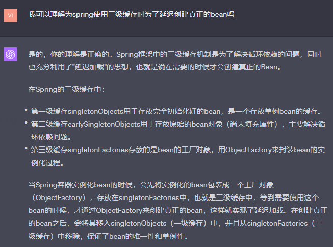


# 10 spring创建对象涉及到的设计模式
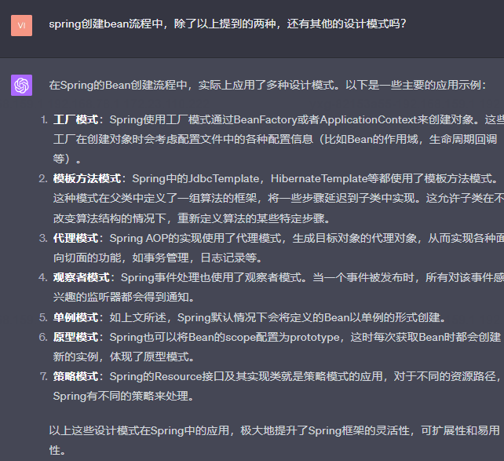

## 10.1 单例模式
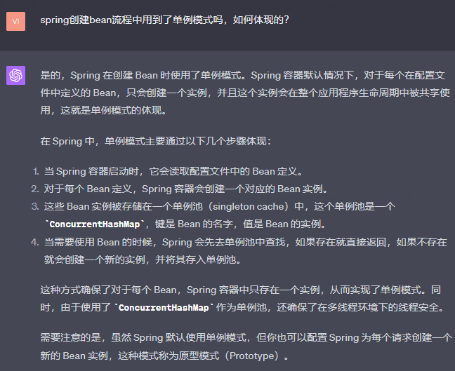

## 10.2 原型模式
Spring也可以将Bean的scope配置为prototype，这时每次获取Bean时都会创建新的实例，体现了原型模式。

## 10.3 代理模式
Spring AOP的实现使用了代理模式，生成目标对象的代理对象，从而实现各种面向切面的功能，如事务管理，日志记录等。
在本项目中，这种设计模式体现在createProxy方法中。

## 10.4 工厂方法模式
这里的ObjectFactory如何体现工厂方法的设计模式呢？
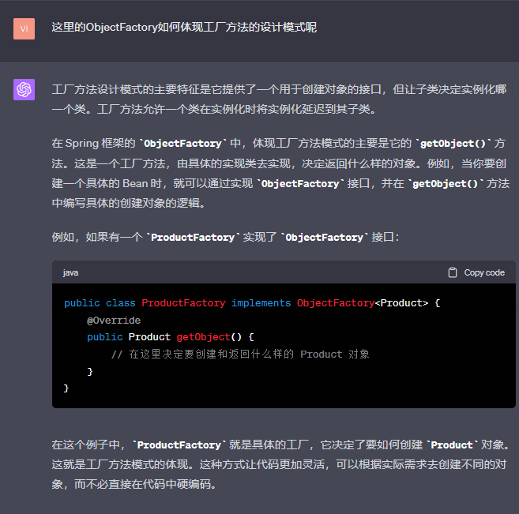

下面是工厂方法模式一般性demo:
重点看第一块，第二块代码是具体被创建的对象：
```java
public interface AnimalFactory {
    Animal createAnimal();
}

public class DogFactory implements AnimalFactory {
    public Dog createAnimal() {
        return new Dog();
    }
}

public class CatFactory implements AnimalFactory {
    public Cat createAnimal() {
        return new Cat();
    }
}
```

```java
public interface Animal {
    void eat();
    void sound();
}

public class Cat implements Animal {
    @Override
    public void eat() {
        System.out.println("The cat is eating");
    }

    @Override
    public void sound() {
        System.out.println("The cat says: Meow");
    }
}

public class Dog implements Animal {
    @Override
    public void eat() {
        System.out.println("The dog is eating");
    }

    @Override
    public void sound() {
        System.out.println("The dog says: Woof");
    }
}

```


## 10.5 策略模式
Spring的Resource接口及其实现类就是策略模式的应用，对于不同的资源路径，Spring有不同的策略来处理
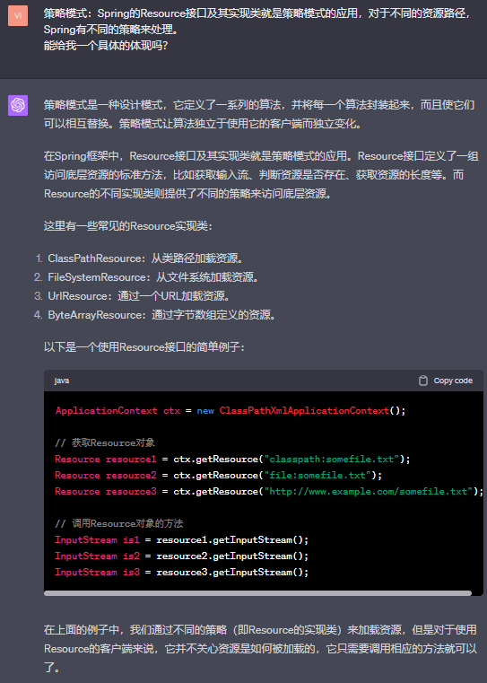


## 10.6 模板方法模式（因为jdbcTemplate通常会被加载到spring容器中）
Spring中的JdbcTemplate，HibernateTemplate等都使用了模板方法模式。
这种模式在基础类中定义了一组算法的框架，将一些步骤延迟到子类/实现类中实现。
这允许子类/实现类在不改变算法结构的情况下，重新定义算法的某些特定步骤

JdbcTemplate 是 Spring 中对 JDBC 进行封装，提供一种相对简便的使用方式。其使用了模板方法设计模式，即在父类中定义处理流程的框架，具体步骤由子类实现。

1 以下是一个例子：

```java
import org.springframework.jdbc.core.JdbcTemplate;
import org.springframework.jdbc.core.RowMapper;

import javax.sql.DataSource;
import java.sql.ResultSet;
import java.sql.SQLException;

public class EmployeeDao {
    private JdbcTemplate jdbcTemplate;

    public EmployeeDao(DataSource dataSource) {
        jdbcTemplate = new JdbcTemplate(dataSource);
    }

    public Employee getEmployeeById(int id) {
        String query = "SELECT * FROM employees WHERE id = ?";
        Employee employee = jdbcTemplate.queryForObject(query, new RowMapper<Employee>() {
            @Override
            public Employee mapRow(ResultSet rs, int rowNum) throws SQLException {
                Employee emp = new Employee();
                emp.setId(rs.getInt("id"));
                emp.setName(rs.getString("name"));
                emp.setAge(rs.getInt("age"));
                return emp;
            }
        }, id);
        return employee;
    }
}
```

这个例子中，`queryForObject` 是 JdbcTemplate 的一个模板方法，它处理了创建连接，执行查询，处理异常，关闭连接等步骤。而 `RowMapper` 中的 `mapRow` 方法是一个回调方法，它允许我们自定义如何从 ResultSet 中获取数据。这是一个典型的模板方法设计模式的例子，其中模板方法是 `queryForObject`，回调方法是 `mapRow`。


2 但是这里的子类在哪里体现？

> 我的解释可能引起了一些混淆。在这个上下文中，JdbcTemplate使用了模板方法设计模式，但它并不依赖于使用子类来实现这种模式。
模板方法设计模式通常涉及到一个基础类（或接口）定义了算法或工作流程的骨架，然后允许子类或实现类提供特定步骤的实现。然而，在这个例子中，JdbcTemplate将这种模式与回调函数模式结合起来使用，允许用户提供一个实现了特定接口（在本例中是RowMapper）的对象，该对象提供了算法某部分步骤的实现。
因此，"子类"的体现不是在类的继承层次结构中，而是在通过回调函数提供行为的方式中。在这种情况下，RowMapper就是这样的"子类"，它不是通过继承来体现的，而是通过实现特定接口来体现的。用户提供的匿名类或者lambda表达式等，实际上在某种程度上类似于在子类中实现模板方法的某些步骤。

3 如果不实现基础类，那会报错吗?

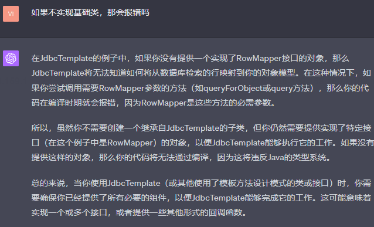

## 10.7 spring中抽象工厂模式

Spring使用抽象工厂模式通过BeanFactory或者ApplicationContext来创建对象（两个不同的抽象工厂）。
这些工厂在创建对象时会考虑配置文件中的各种配置信息（比如Bean的作用域，生命周期回调等）。

### 10.7.1 抽象工厂模式和工厂方法模式的区别
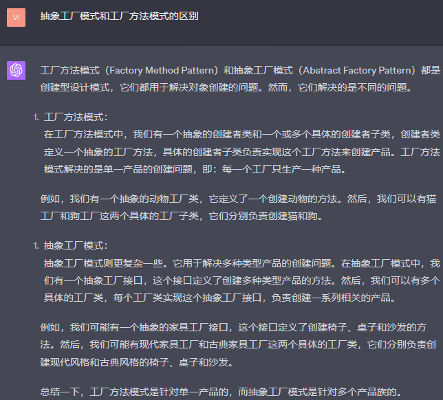

### 10.7.2 ApplicationContext是一个工厂方法接口还是抽象工厂接口呢
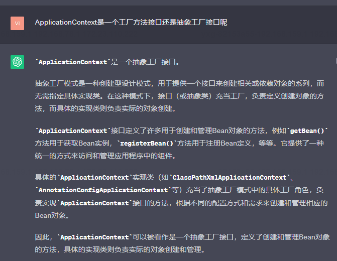

### 10.7.3 ApplicationContext 有哪些实现类（或子工厂），并且介绍一下作用

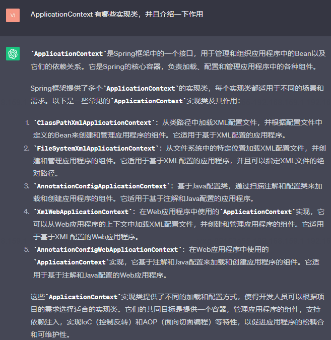

### 10.7.4 ApplicationContext是不是一个多级工厂？
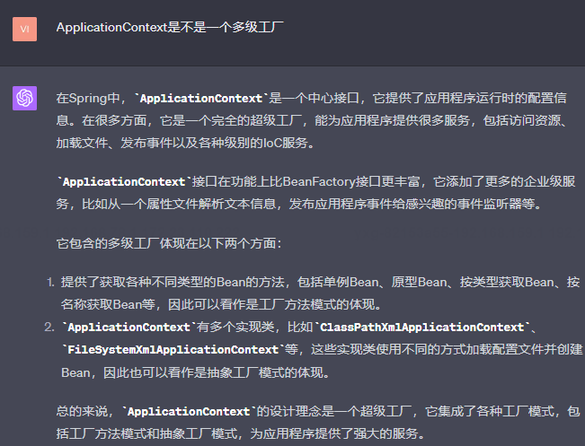

重点是：ApplicationContext的实现类本身也是一个抽象工厂，为什么这么说？

> 因为spring的三级缓存Map中，每一个value都是一个工厂方法，对应一类业务接口（每一个业务接口有多个是西安类）

### 10.7.5 如果ApplicationContext是抽象工厂，难道ApplicationContext不应该是一个抽象类吗？
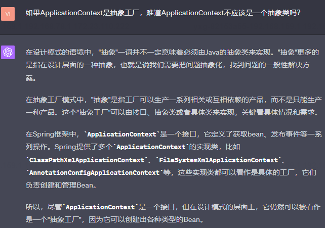

## 10.8 下面是整个spring框架涉及到的设计模式：

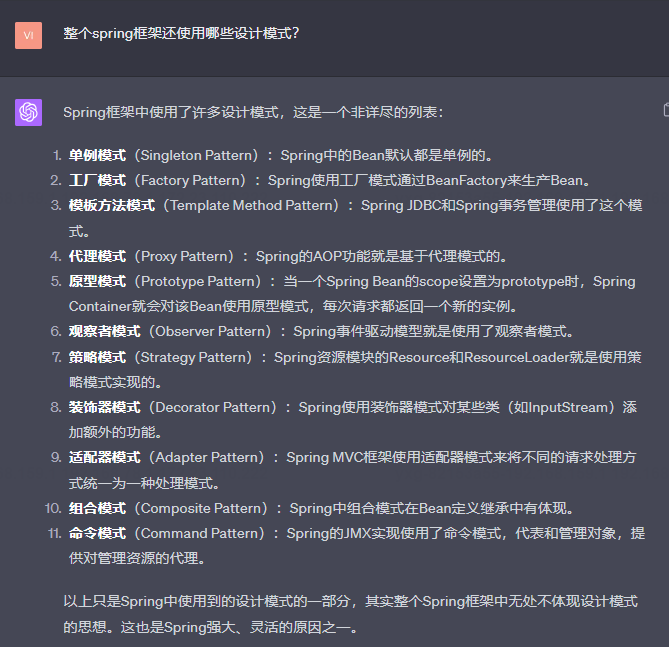

## 10.9 装饰器模式（Decorator Pattern）
Spring使用装饰器模式对某些类（如InputStream）在不改变原有结构的情况下添加额外的功能。

下面详细介绍一下，并且给一个例子：

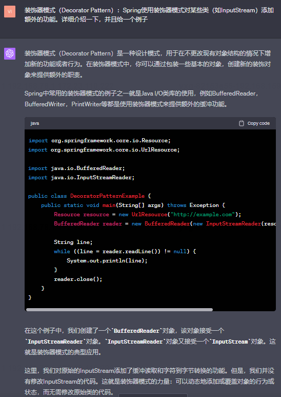

## 10.10 适配器模式

### 10.10.1 适配器的主要作用
适配器模式（Adapter Pattern）是一种结构型设计模式，主要用于使得原本不兼容的接口可以相互协作。

### 10.10.2 下面是一个解决兼容问题的具体例子：

当然，我们可以通过一个简单的例子来解释一下适配器模式在实际代码中的应用。在这个例子中，我们将创建一个MediaPlayer接口和一个实现了MediaPlayer接口的AudioPlayer类。实体类VlcPlayer和Mp4Player实现了一个更高级的接口AdvancedMediaPlayer。Adapter类MediaAdapter是实现了MediaPlayer接口的适配器类。

首先，我们来创建接口：

```java
// MediaPlayer.java
public interface MediaPlayer {
    void play(String audioType, String fileName);
}

// AdvancedMediaPlayer.java
public interface AdvancedMediaPlayer {   
    void playVlc(String fileName);
    void playMp4(String fileName);
}
```

然后，创建实现了 AdvancedMediaPlayer 接口的实体类。

```java
// VlcPlayer.java
public class VlcPlayer implements AdvancedMediaPlayer {
    @Override
    public void playVlc(String fileName) {
        System.out.println("Playing vlc file. Name: "+ fileName);      
    }

    @Override
    public void playMp4(String fileName) {
        //什么也不做
    }
}

// Mp4Player.java
public class Mp4Player implements AdvancedMediaPlayer {
    @Override
    public void playVlc(String fileName) {
        //什么也不做
    }

    @Override
    public void playMp4(String fileName) {
        System.out.println("Playing mp4 file. Name: "+ fileName);      
    }
}
```

然后，我们创建实现了 MediaPlayer 接口的适配器类 MediaAdapter。

```java
// MediaAdapter.java
public class MediaAdapter implements MediaPlayer {

    AdvancedMediaPlayer advancedMusicPlayer;

    public MediaAdapter(String audioType){

        if(audioType.equalsIgnoreCase("vlc") ){
            advancedMusicPlayer = new VlcPlayer();       

        }else if (audioType.equalsIgnoreCase("mp4")){
            advancedMusicPlayer = new Mp4Player();
        }   
    }

    @Override
    public void play(String audioType, String fileName) {

        if(audioType.equalsIgnoreCase("vlc")){
            advancedMusicPlayer.playVlc(fileName);
        }
        else if(audioType.equalsIgnoreCase("mp4")){
            advancedMusicPlayer.playMp4(fileName);
        }
    }
}
```

最后，创建实现了 MediaPlayer 接口的 AudioPlayer 类，AudioPlayer 类使用 MediaAdapter 传递所需的音频类型。

```java
// AudioPlayer.java
public class AudioPlayer implements MediaPlayer {
    MediaAdapter mediaAdapter; 

    @Override
    public void play(String audioType, String fileName) {      

        //播放 mp3 音乐文件的内置支持
        if(audioType.equalsIgnoreCase("mp3")){
            System.out.println("Playing mp3 file. Name: " + fileName);            
        } 
        //mediaAdapter 提供了播放其他文件格式的支持
        else if(audioType.equalsIgnoreCase("vlc") || audioType.equalsIgnoreCase("mp4")){
            mediaAdapter = new MediaAdapter(audioType);
            mediaAdapter.play(audioType, fileName);
        }
        else{
            System.out.println("Invalid media. " + audioType + " format not supported");
        }
    }   
}
```

通过上述代码，我们成功实现了适配器模式，即使VlcPlayer和Mp4Player并不实现MediaPlayer接口，但是通过MediaAdapter这个适配器，AudioPlayer仍然可以调用VlcPlayer和Mp4Player的功能，达到适配的效果。


## 10.11 spring组合模式

组合模式（Composite Pattern）在Spring框架中的应用主要是在Spring组件（Bean）的组合和组装上。举个例子，我们可以在一个Spring应用中将多个单独的Bean组合在一起，形成一个更大的组件（Composite）。这个更大的组件可能是一个服务类，它可能由其他多个服务、DAO或其他组件组成。

首先，我们需要创建一个基本的组件接口。在Spring中，我们可以将其视为一个基本的Spring Bean：

```java
public interface Component {
    void operation();
}
```

然后，我们可以创建基本组件和组合组件：

```java
// Leaf.java
public class Leaf implements Component {
    private String name;

    public Leaf(String name) {
        this.name = name;
    }

    @Override
    public void operation() {
        System.out.println("Leaf " + name + " is operated.");
    }
}

// Composite.java
public class Composite implements Component {
    private List<Component> childComponents = new ArrayList<>();

    public void add(Component component) {
        childComponents.add(component);
    }

    public void remove(Component component) {
        childComponents.remove(component);
    }

    @Override
    public void operation() {
        for (Component child : childComponents) {
            child.operation();
        }
    }
}
```

在Spring中，你可以像下面这样将这些Bean组合起来：

```java
@Configuration
public class AppConfig {

    @Bean
    public Leaf leaf1() {
        return new Leaf("leaf1");
    }

    @Bean
    public Leaf leaf2() {
        return new Leaf("leaf2");
    }

    @Bean
    public Composite composite() {
        Composite composite = new Composite();
        composite.add(leaf1());
        composite.add(leaf2());
        return composite;
    }
}
```

在上述的配置中，`composite` Bean包含了`leaf1`和`leaf2`。这就是在Spring中使用组合模式的一个简单示例。

## 10.12 spring的命令模式

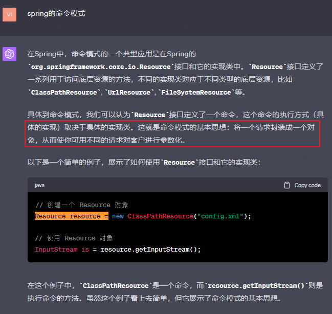

### 10.12.2 这就是命令模式的基本思想：将一个请求封装成一个对象，从而使你可用不同的请求对客户进行参数化。举一个与C/S请求相关但是使用到命令模式的case
假设你正在构建一个网页应用，你有一个“前端请求处理器”，这个处理器接收到前端发送的各种类型的请求并相应地处理它们。在这个场景下，每一种请求可以被看作是一个命令。

首先，定义一个表示命令的接口：

```java
public interface Command {
    void execute();
}
```

然后，你可以针对每一种请求创建一个实现了Command接口的类：

```java
public class LoadPageCommand implements Command {
    private PageLoader pageLoader;

    public LoadPageCommand(PageLoader pageLoader) {
        this.pageLoader = pageLoader;
    }

    @Override
    public void execute() {
        pageLoader.load();
    }
}

public class SubmitFormCommand implements Command {
    private FormHandler formHandler;

    public SubmitFormCommand(FormHandler formHandler) {
        this.formHandler = formHandler;
    }

    @Override
    public void execute() {
        formHandler.submit();
    }
}
```

在上面的例子中，`LoadPageCommand` 和 `SubmitFormCommand` 都是具体的命令，它们封装了各自的请求处理逻辑。

最后，你可以在前端请求处理器中使用这些命令：

```java
public class FrontEndRequestHandler {
    private Map<String, Command> commands;

    public FrontEndRequestHandler(Map<String, Command> commands) {
        this.commands = commands;
    }

    public void handleRequest(String request) {
        Command command = commands.get(request);
        if (command != null) {
            command.execute();
        } else {
            // Handle invalid request
        }
    }
}
```

这样，你就使用命令模式将各种请求处理逻辑封装成了对象，使得前端请求处理器能以统一的方式处理各种类型的请求。


# 10 疑问点
## 10.1 

```java
// 方法一：
public class BeanDefinition {

    private Object bean;

    public BeanDefinition(Object bean) {
        this.bean = bean;
    }

    public Object getBean() {
        return bean;
    }
}
// 方法二：
public class BeanDefinition {

    private Class beanClass;

    public BeanDefinition(Class beanClass) {
        this.beanClass = beanClass;
    }
    public Object getBean() {
        return beanClass;
    }
}
```
在实现一个IOC容器中，我将方法一换成了二后这样就可以把 Bean 的实例化操作放到容器中处理了，为什么？


这一点可以从测试点看出差异：

针对方法一，其调用过程如下所示：
```java
    @Test
    public void test_BeanFactory(){
        // 1.初始化 BeanFactory
        MyBeanContainer beanFactory = new MyBeanContainer();

        // 2.注入bean
        BeanDefinition beanDefinition = new BeanDefinition(new UserService());
        beanFactory.register("userService", beanDefinition);

        // 3.获取bean
        UserService userService = (UserService) beanFactory.getBean("userService");
        System.out.print(userService);
        userService.queryUserInfo();
    }
```
针对方法二，调用过程是：


## 9.2为什么需要二级缓存earlyReferenceMap？
当对象A有一个类型为B的属性时，这个时候A先生成

